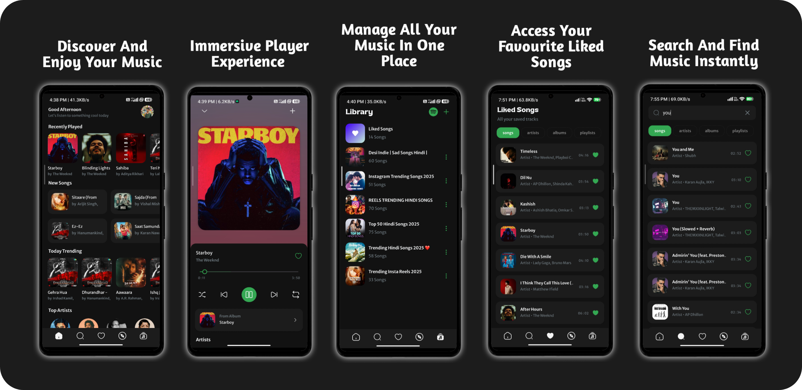

# 🎧𝗠𝘂𝘀𝗶𝗳𝘆 - 𝗠𝘂𝘀𝗶𝗰 𝗦𝘁𝗿𝗲𝗮𝗺𝗶𝗻𝗴 𝗔𝗽𝗽
**Musify is an Android-based music streaming application focused on performance, usability, and modern UI design. It offers seamless music playback, personalized discovery, and a visually engaging interface to enhance the overall listening experience.**



# 𝗪𝗵𝘆 𝗠𝘂𝘀𝗶𝗳𝘆❓
**🎧 Ad-Free Listening Experience :** Enjoy uninterrupted music playback without ads, ensuring a smooth and distraction-free listening experience.

**🔄 Spotify Playlist Import :** Easily import and access your favorite playlists from Spotify, allowing a seamless transition and continued enjoyment of your music collection.

**💡Kotlin-Powered Learning :** Musify is more than just a music app—it serves as a hands-on learning project built with Kotlin and modern Android architecture.
It demonstrates clean code practices, efficient state management, and seamless UI interactions, showcasing the balance between elegant design and high-performance native Android development.

# ✨ 𝗙𝗲𝗮𝘁𝘂𝗿𝗲𝘀
**🚀 Free Music Playback :**

Listen to your favorite music completely free, with smooth and uninterrupted playback.

**🔍 Discover & Enjoy Music :**

Explore trending tracks, new releases, and personalized recommendations tailored to your listening habits.

**🎶 Immersive Player Experience :**

Enjoy a visually rich and smooth music player with intuitive controls for a seamless listening experience.

**📚 All-in-One Music Library :**

Manage all your songs, albums, and playlists in one centralized and organized library.

**❤️ Liked Songs Collection :**

Quickly access and manage your favorite tracks in a dedicated liked songs section.

**🔎 Instant Music Search :**

Search and find songs, artists, albums, and playlists instantly with fast and responsive search functionality.<br>
<br>

**<h3 align=center>𝐃𝐨𝐰𝐧𝐥𝐨𝐚𝐝 𝐟𝐨𝐫 𝐀𝐧𝐝𝐫𝐨𝐢𝐝</h3>**
<h3 align=center>
<a href="https://github.com/harshstr14/Musify/releases/download/v2.256/musify.apk">
  
</a>
</h3><br>

## 🚀 𝗜𝗻𝘀𝘁𝗮𝗹𝗹𝗮𝘁𝗶𝗼𝗻

1.  Clone the repository:
    ```bash
    git clone https://github.com/your-username/musify.git
    ```
2.  Open the project in Android Studio.
3.  Create a `local.properties` file in the root of the project and add your API keys:
    ```
    API_BASE_URL="YOUR_API_BASE_URL"
    SPOTIFY_API_BASE_URL="YOUR_SPOTIFY_API_BASE_URL"
    ```
4.  Sync the project with Gradle files.
5.  Build and run the app on an Android emulator or a physical device (API 26+).

## 🤝 𝗖𝗼𝗻𝘁𝗿𝗶𝗯𝘂𝘁𝗶𝗻𝗴 𝗚𝘂𝗶𝗱𝗲𝗹𝗶𝗻𝗲𝘀

Contributions are welcome! To contribute to this project, follow these steps:

1.  Fork the repository 🍴.
2.  Create a new branch for your feature or bug fix 🌱.
3.  Make your changes and commit them with descriptive commit messages 📝.
4.  Test your changes thoroughly ✅.
5.  Submit a pull request to the `master` branch 🔄.

## 📜 𝗟𝗶𝗰𝗲𝗻𝘀𝗲 𝗜𝗻𝗳𝗼𝗿𝗺𝗮𝘁𝗶𝗼𝗻

No license specified. All rights reserved.

## 📬 𝗖𝗼𝗻𝘁𝗮𝗰𝘁/𝗦𝘂𝗽𝗽𝗼𝗿𝘁 𝗜𝗻𝗳𝗼𝗿𝗺𝗮𝘁𝗶𝗼𝗻

For questions or support, please contact: harshstr14@gmail.com
